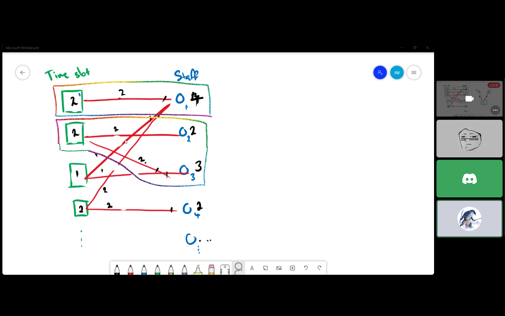

# Meeting of 16-07-2021

## Minutes:

 - Discussion of the way which the algorithm will be implemented
 - Jasons idea is to sort the units based on the ones with the fewest tutors to perform those tutes.
 - when you have the tutors for that class divide it evenly between the tutors.
 - first allocate by the tutors who can do the only days which are avaialble.
 - draw graph lines between the classes and tutors then use the class period for the class to map the tutors hours (screenshot)

## Todo:

 - Allocation stuff done.
 - timeslot object should be embedded in the units timeslot list
   - 
